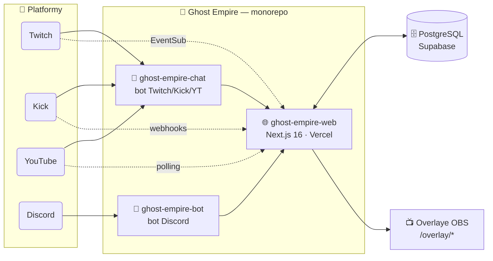
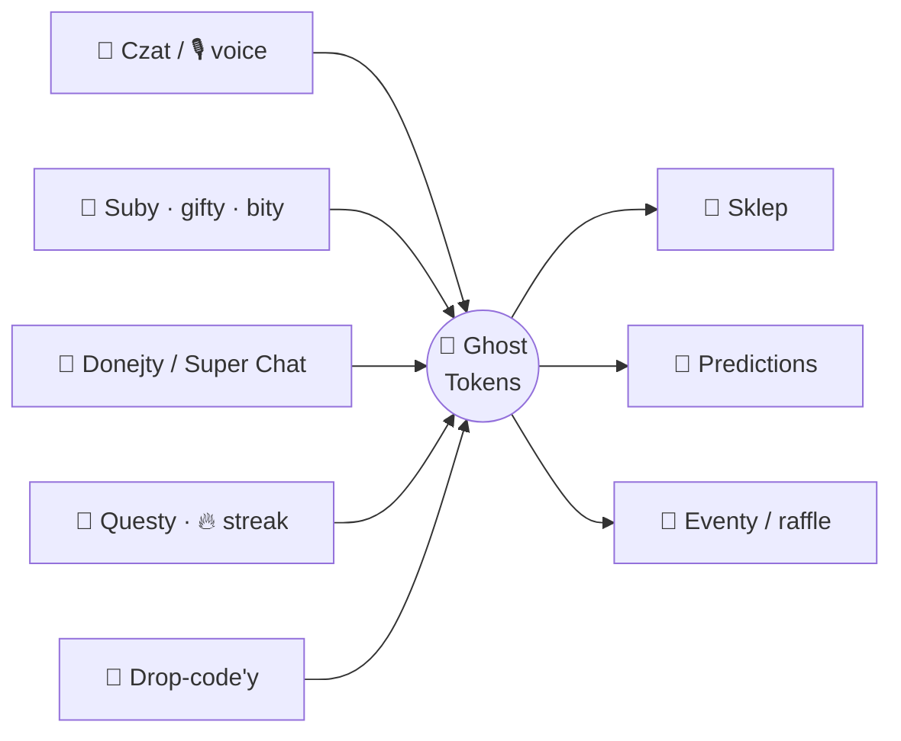
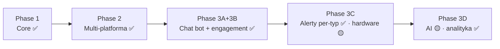

<div align="center">


### 👻 Community portal + ekosystem botów dla streamera [**Gh0s77tt**](https://twitch.tv/gh0s77tt)


<br/>


[](https://ghost-empire-web.vercel.app)
[](CHANGELOG.md)
[](ROADMAP.md)
[](https://twitch.tv/gh0s77tt)
[](https://kick.com/Gh0s77tt)
[](https://www.youtube.com/@Gh0s77tt)

`Phase 2 ✅` &nbsp; `Phase 3A–3D ✅` &nbsp; `Studio F1–F3 + F5 ✅` &nbsp; `F6 security 🟡` &nbsp; `F4 AI 🔑 czeka na klucz`

</div>

---

## ⚡ TL;DR

Portal **Next.js** + boty, w których widzowie zarabiają **Ghost Tokens (GT)** za aktywność na Discordzie i streamach — czat, voice, suby, gifty, bity, donejty, drop-code'y, daily questy, predictions — i wymieniają je w **sklepie** na nagrody cyfrowe i fizyczne. Streamer steruje wszystkim z panelu **`/admin`** (~37 sekcji w 7 grupach, `Ctrl+K` do skoku): sklep, eventy, losowania, donacje, role, **alerty OBS (per-typ)**, stream goals, predictions, battle pass, ankiety, merge duplikatów, **moderacja czatu (automod)**, **biblioteka + generator widgetów**, **panel integracji (klucze API na stronie)** + **komendy czatu, timery, FAQ, powitania i song requesty** dla bota na 3 platformach.

> Suby/gifty/bity (Twitch + Kick), donacje (Streamlabs + YouTube Super Chat) są **wykrywane automatycznie** (webhooki / polling) i nagradzane tokenami + odznakami.

---

## ✨ W skrócie — co potrafi

`👻 Ekonomia GT` &nbsp; `🛒 Sklep` &nbsp; `🎁 Eventy & raffle` &nbsp; `🎲 Predictions` &nbsp; `🏆 Battle Pass / Sezony` &nbsp; `🗳️ Ankiety` &nbsp; `🏅 53 osiągnięcia` &nbsp; `📅 Daily questy` &nbsp; `🔑 Drop-code'y` &nbsp; `📊 Ranking` &nbsp; `💬 Chat bot ×3 platformy` &nbsp; `🛡️ Automod` &nbsp; `⏱️ Timery` &nbsp; `❓ FAQ` &nbsp; `👋 Powitania` &nbsp; `🎵 Song requesty` &nbsp; `🔔 Alerty OBS (per-typ)` &nbsp; `🎯 Stream Goals + Hype Train` &nbsp; `⏳ Subathon` &nbsp; `🧩 Biblioteka + generator widgetów` &nbsp; `🖼️ 11 overlayów z podglądem`

---

## 🆕 Studio (2026-06) — customizacja · widgety · moderacja · UX

Duża seria po Phase 3D (44+ PR-ów):

- **🎰 Koło Fortuny:** widzowie wydają GT, kręcą ważonym kołem i wygrywają nagrody — strona `/wheel` + animowany overlay OBS `/overlay/wheel` + panel admina (segmenty, koszt, bilans domu).
- **⚔️ Pojedynki PvP `!duel`:** dwóch widzów stawia GT, uczciwy coinflip (crypto-RNG) wyłania zwycięzcę biorącego pulę minus 5% rake. `!duel 100` (otwarte) / `!duel @nick 100` / `!accept` / `!decline` — atomowy transfer w jednej transakcji (`lib/duels.ts`), na Twitch/Kick/YouTube. Rekord **W/L + winrate** na profilu.
- **✦ Prestiż (Phantom Ascension):** po max poziomie (100) dalsze XP daje **gwiazdki prestiżu** (co 50 000 XP ponad cap, bez resetu) — perk **+2% GT z czatu / gwiazdkę** (kumulowany z perkiem poziomu), ✦ na profilu i w rankingu. Czysta pochodna lifetime XP (`prestigeFromXp`).
- **🛒 Perk lojalnościowy w sklepie:** poziom konta + prestiż **obniżają ceny** (−0,15%/lvl + −1%/✦, do **−30%**) — zniżka naliczana serwerowo (`discountedPrice`, źródło prawdy), pokazywana na karcie (oryginał przekreślony), w modalu i podsumowaniu perków.
- **🔐 Bezpieczeństwo:** **szyfrowanie sekretów at-rest** (AES-256-GCM) — klucze API i wszystkie tokeny OAuth/streamer w bazie · nagłówki `noindex`/`no-store` na overlayach · cron czyszczący stare rekordy.
- **💬 Czat:** **prawdziwe odznaki Twitch** + **emotki 7TV / BTTV / FFZ** w overlayu czatu (kanałowe i globalne).
- **🛡️ Moderacja:** **eskalacja recydywistów** (ostrzeżenie → usuń → timeout ×2) + **statystyki naruszeń** (top sprawcy, wykres typów).
- **🎲 Predictions:** **auto-zamykanie** po czasie + toggle „ogłaszaj na czacie" per zakład.
- **🎨 F1 — customizacja:** Subathon (edytowalny kolor + napis) · predykcje + ankiety (kolor akcentu, **podgląd na żywo**, overlay OBS, **auto-pin zakładu na czacie**) · **plan streamów jako kalendarz miesięczny**.
- **🛡️ F2 — moderacja czatu (automod):** panel `/admin#moderation` (przekleństwa z leetspeak · CAPS · długość · powtórzenia/flood · zalgo, akcje delete/timeout/warn, whitelista sub/VIP/mod) + **egzekucja w bocie** na Twitch/Kick/YouTube.
- **🧩 F3 — widgety:** **biblioteka** wszystkich overlayów (URL + **podgląd**) + 6 nowych (ostatni sub/donator/follower, viewer count, **emoji combo**) + **generator własnych widgetów** (tekst / kolor / font / gradient / emoji).
- **✍️ F5 — wygląd:** **13 czcionek** · emoji-picker · **emotki + odznaki Twitcha w overlayu czatu** · gradienty.
- **🔒 F6 — security (część):** **backup do JSON** · sanityzacja URL (XSS).
- **🧭 UX:** **grupowana, zwijana nawigacja** · **command palette `Ctrl+K`** · **checklista statusu** na dashboardzie · **panel integracji** (klucze API wklejasz na stronie, nie w plikach) · podgląd + edycja per-widget.

> 🔑 **Następny duży krok: F4 — AI** (postać `@bot` + `!imagine`). Czeka tylko na wklejenie klucza API w `/admin#integrations`.

---

## 🏗️ Architektura



## 💰 Ekonomia Ghost Tokens



---

## 🧱 Tech stack (aktualne wersje)

| Warstwa | Technologia |
|---|---|
| **Framework** | Next.js **16** (App Router, RSC) · React **19** · TypeScript **6** |
| **Styl** | Tailwind CSS **4** (`@theme`, `@tailwindcss/postcss`) · Lucide **1.x** · własne ikony marek (SVG) |
| **Backend / DB** | Next API routes · Prisma **7** (driver adapter `@prisma/adapter-pg`) · PostgreSQL (Supabase / Supavisor) · Zod **4** |
| **Auth** | NextAuth **4.24** + PrismaAdapter · OAuth: Twitch / Kick / Discord / Google→YouTube |
| **Realtime** | DB-backed kolejki + polling (overlaye, notyfikacje) — Vercel Hobby = bez websocketów |
| **Boty** | discord.js **14.26** · tmi.js (Twitch) · Kick/YT API · `tsx`, TypeScript 6 |
| **Jakość** | Vitest **4** (41 testów) · ESLint **9** (flat config) · GitHub Actions CI · Dependabot · GitGuardian |
| **Deploy** | Vercel (web, auto-deploy z `main`) · bot na PC/Docker (gotowy na VPS/Railway) |

> Cały stack jest na **najnowszych majorach** (modernizacja udokumentowana w [CHANGELOG.md](CHANGELOG.md)). Świadomie pominięte: `next-auth v5` (beta) i `eslint 10` (ekosystem `eslint-config-next` 16 jeszcze go nie wspiera).

---

## 🎮 Features

<details open>
<summary><b>Phase 1 — Core ✅</b></summary>

- **Logowanie** Twitch / Kick / Discord / Google — linkowalne na jedno konto (`/profile`)
- **Ghost Tokens** za aktywność (Discord msg/voice, questy, drop-code'y + źródła streamowe)
- **Sklep** (`/shop`) — itemy z requirementami (level, sub tier, dual platform, **odblokowanie przez osiągnięcie**) + grafiki
- **Eventy** (`/events`) — giveaway, raffle z biletami, contest, happy hour (mnożnik) + **szablony okolicznościowe**
- **Ranking** (`/ranking`), **Profil** (`/profile`), **profil publiczny** (`/u/[username]`) z **dynamicznym OG per ranga**
- **53 osiągnięcia** (4 rzadkości, auto-grant), **daily questy**, **streak**, **drop-code'y**, **ankiety** (`/polls`)
- **Discord bot** — tracking msg/voice, slash commands (`/link`, `/portal`, `/help`), live config
</details>

<details>
<summary><b>Phase 2 — Multi-platforma + monetyzacja ✅</b></summary>

- **Kick + Google/YouTube OAuth** (custom Kick provider), **account linking + merge** duplikatów (atomic `$transaction`)
- **Twitch EventSub** — auto-tracking subów/giftów/bitów (HMAC verify, replay protection)
- **Donacje Streamlabs** (daily polling), **Kick webhooki** (RSA verify), **YouTube Super Chaty/membery** (polling)
- **Stream Alerts (OBS)** — `/overlay?token=` Browser Source, dispatch z 10+ miejsc
</details>

<details>
<summary><b>Phase 3 — Engagement ✅ (3A + 3B) · 3C/3D w toku</b></summary>

- **Chat bot Twitch + Kick + YouTube** — 1 GT/min/widz, komendy z portalu (`/admin#chat`), auto-refresh tokenów
- **Engagement (3B)** — timery, FAQ, powitania, song requesty `!sr`, **chat overlay** (kolory per platforma, customizacja)
- **Stream Goals + Hype Train**, **Predictions** (`/predictions`, auto-zamykanie), **Battle Pass / Sezony** (30 tierów, nagrody tokenowe i rzeczowe), **Subathon**, **Koło Fortuny** (`/wheel` + overlay)
- **Alerty per-typ (3C)** — animacja / pozycja / dźwięk / próg kwotowy **osobno dla każdego typu** (`/admin#alerts`, klik → rozwija)
- **NASTĘPNE (3C/3D):** OBS WebSocket (sceny), Philips Hue / Govee (światła), AI moderator, analityka per-stream — plan w [PHASE3.md](PHASE3.md)
</details>

---

## 🛡️ Reliability · Security · Performance · DX

| Obszar | Co |
|---|---|
| **Reliability** | `error.tsx` / `global-error.tsx` / `loading.tsx`, atomic `$transaction` na każdej mutacji ekonomii, `/api/health` (200/503), **webhooki wychodzące** (Discord/n8n/custom) |
| **Observability** | **Vercel Analytics + Speed Insights** (real-user Core Web Vitals), structured logging (`lib/logger.ts`), **`npm audit` w CI** |
| **Security** | **szyfrowanie sekretów at-rest (AES-256-GCM)** — klucze API + tokeny OAuth · HSTS, CSP, COOP, X-Frame-Options, Permissions-Policy · `noindex`/`no-store` na overlayach · rate-limit (DB sliding-window) · webhook verify (HMAC/RSA) · HMAC-signed cookies · audit log z IP · skan sekretów (GitGuardian) |
| **Performance** | `unstable_cache`, indeksy DB, lazy-load sekcji admina, Router `staleTimes`, `Promise.all`, pula DB `max:3` pod Supabase |
| **a11y** | `:focus-visible`, skip-link, `prefers-reduced-motion`, `aria-label`/`aria-current` na nav, `role="dialog"` na modalach |
| **DX** | `strict` TS · **0 `as any`** w `src` · ESLint flat config w CI · Vitest **111 unit + 11 integration** (realny Postgres w CI) · Dependabot · dokumentacja na bieżąco |

---

## 🧑‍💻 Panel admina (`/admin`)

<details>
<summary><b>~26 sekcji (deep-link przez hash, filtrowane wg uprawnień moderatora)</b></summary>

Dashboard · Użytkownicy (grant GT, role, opisy uprawnień) · Merge duplikatów · **Moderacja (automod + statystyki naruszeń)** · Eventy · Sklep · Drops · **Koło Fortuny** · **Biblioteka gier (Steam)** · Harmonogram · Bot Discord · Donacje · Twitch / Kick / YouTube (autoryzacja + eventy) · Komendy czatu · Timery · FAQ · Powitania · Song requesty · **Stream Alerts (typy + per-typ)** · Stream Goals · Subathon · Predictions · Battle Pass · **Ankiety** · **Analityka (heatmapa czatu)** · **Integracje (klucze API)** · **Webhooki wychodzące** · Audit log · **Reset bazy** (strefa niebezpieczna).
</details>

---

## 🚀 Setup

<details>
<summary><b>🌐 Web (portal)</b></summary>

```powershell
cd ghost-empire-web
cp .env.example .env.local        # wypełnij env (patrz docs/ENV.md)
npm install
npm run db:push                   # schema → Supabase (Prisma 7 + prisma.config.ts)
npm run db:seed                   # osiągnięcia, questy, itemy, eventy
npm run dev                       # → http://localhost:3000
```
Wymagania: **Node 22+**, PostgreSQL (Supabase), konto Vercel + konta dev OAuth.
</details>

<details>
<summary><b>🤖 Bot Discord</b></summary>

```powershell
cd ghost-empire-bot
cp .env.example .env              # DISCORD_BOT_TOKEN, BOT_SECRET (= web BOT_SECRET)
npm install && npm run dev
```
Szczegóły: [`ghost-empire-bot/README.md`](ghost-empire-bot/README.md).
</details>

<details>
<summary><b>💬 Bot czatu (Twitch/Kick/YouTube)</b></summary>

```powershell
cd ghost-empire-chat
cp .env.example .env
npm install
npm run auth:twitch && npm run auth:kick && npm run auth:youtube   # jednorazowa autoryzacja
npm start
```
Szczegóły: [`ghost-empire-chat/README.md`](ghost-empire-chat/README.md).
</details>

<details>
<summary><b>🔌 OAuth per platforma + integracje (EventSub / Kick / YouTube / OBS)</b></summary>

Redirect URI: `https://<domena>/api/auth/callback/<provider>` (i `http://localhost:3000/...` dla dev).

| Provider | Konsola | Scopes |
|---|---|---|
| Twitch | dev.twitch.tv/console | `openid user:read:email` + EventSub |
| Discord | discord.com/developers | `identify email guilds` |
| Google | console.cloud.google.com | `openid email profile` + `youtube.readonly` |
| Kick | docs.kick.com | `user:read` + webhooki |

Pełny przewodnik (EventSub, Kick webhooki, YouTube polling, OBS Browser Source) — w starszych sekcjach + [docs/ENV.md](docs/ENV.md). ⚠️ Sekrety wrzucaj do **Vercel env** / gitignored `.env`, nigdy do repo.
</details>

---

## 📖 Dokumentacja (GitBook-style)

| 📄 | Dokument |
|---|---|
| 🧭 | [**PLAN.md**](PLAN.md) — analiza + wykonawczy plan ukończenia (co zostało, kolejność) |
| 📜 | [**CHANGELOG.md**](CHANGELOG.md) — historia zmian per data + „Setup po pull" |
| 🗺️ | [**ROADMAP.md**](ROADMAP.md) — przyszłość + propozycje optymalizacji |
| 🛡️ | [**PERMISSIONS.md**](PERMISSIONS.md) — uprawnienia admin vs moderator |
| 🧩 | [**docs/ARCHITECTURE.md**](docs/ARCHITECTURE.md) — architektura 3 pakietów + przepływ GT |
| 🔗 | [**docs/ENDPOINTS.md**](docs/ENDPOINTS.md) — trasy API wg modelu autoryzacji |
| 🔑 | [**docs/ENV.md**](docs/ENV.md) — wszystkie zmienne środowiskowe |
| 📦 | [**PHASE2.md**](PHASE2.md) · [**PHASE3.md**](PHASE3.md) — roadmapy faz |

> ### 📝 Zasada dokumentacji (żelazna)
> Dokumentacja **nigdy nie zostaje w tyle za kodem.** Każda zmiana funkcjonalna aktualizuje w **tym samym PR**: **CHANGELOG** + (jeśli dotyczy) **README · ROADMAP · PLAN · PHASE2/3 · docs/ARCHITECTURE · docs/ENDPOINTS · docs/ENV · PERMISSIONS** + on-site changelog (`/about`). PR bez odpowiedniej aktualizacji docs jest niekompletny.

---

## 🗺️ Status



- ✅ **Zrobione:** Phase 1 + 2 + 3A + 3B + rdzeń 3C/3D (alerty per-typ, predictions, battle pass, subathon, heatmapy, ankiety) + cały **nowoczesny stack** (Next 16 / React 19 / Prisma 7 / Tailwind 4 / zod 4 / vitest 4).
- 🟡 **Zostało (creds-gated):** OBS WebSocket, Hue/Govee, AI moderator, social OAuth (IG/TikTok/X/FB), Sentry. Szczegóły: [ROADMAP.md](ROADMAP.md) + [PHASE3.md](PHASE3.md).

---

<div align="center">


**Private** · Gh0s77tt © 2026 · zbudowane z 👻 i 🩸

</div>
