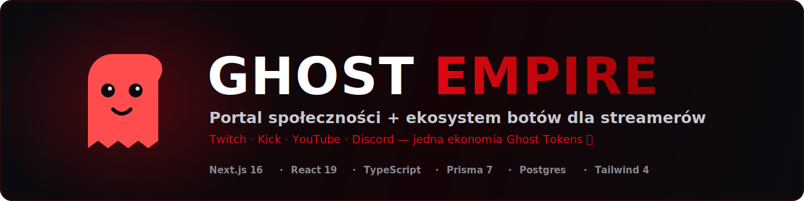
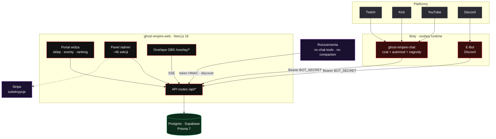

<div align="center">

<picture>
  <source media="(prefers-color-scheme: dark)" srcset="docs/assets/banner-dark.svg">
  <source media="(prefers-color-scheme: light)" srcset="docs/assets/banner-light.svg">
  
</picture>

<br/>

[](https://gitlab.com/Gh0s777tt/ghost-empire/-/pipelines)
[](https://gitlab.com/Gh0s777tt/ghost-empire/-/pipelines)
[](https://gitlab.com/Gh0s777tt/ghost-empire/-/commits/main)
[](LICENSE)
[](https://www.empire-forge.com)

**[🌐 Live](https://www.empire-forge.com)** · **[📚 Dokumentacja](https://gh0s777tt.gitlab.io/ghost-empire/)** · **[🗺️ Roadmapa](ROADMAP.md)** · **[📜 Changelog](CHANGELOG.md)** · **[🔐 Bezpieczeństwo](SECURITY.md)**

</div>

---

Ghost Empire to **portal społeczności + ekosystem botów**, w którym widzowie zdobywają wirtualne **Ghost Tokens (GT)** za aktywność na Twitchu, Kicku, YouTube i Discordzie, a streamer zarządza całą ekonomią, eventami i overlayami OBS z jednego panelu.

## 💡 Dlaczego to powstało

Zaangażowanie widzów jest rozsypane po platformach, a gotowe narzędzia (StreamElements, StreamLabs) są zamknięte, drogie i nie łączą Twitcha z Kickiem, YouTube i Discordem w **jedną** ekonomię. Ghost Empire to **jeden system lojalnościowy dla całej społeczności**: widz ma jedno konto i jedno saldo GT niezależnie od tego, gdzie ogląda; streamer dostaje panel, który zastępuje kilka subskrypcji SaaS; a całość jest **white-label multi-tenant** — ten sam kod obsługuje wiele portali (marka „E-Forge"), każdy z własną walutą, brandingiem i domeną.

> Suby, gifty i bity (Twitch + Kick) oraz donacje (Streamlabs + YouTube Super Chat) są **wykrywane automatycznie** (webhooki / polling) i nagradzane tokenami — bez ręcznej obsługi.

## ✨ Co potrafi

| Ekonomia i zaangażowanie | Streamer / Admin | Boty i overlaye |
|---|---|---|
| 👻 Ghost Tokens za czat, voice, suby, donacje | 🛒 Sklep (nagrody cyfrowe i fizyczne) | 💬 Chat bot na Twitch / Kick / YouTube |
| 🎁 Eventy, raffle, giveaway, konkursy | 🎯 Stream Goals + Hype Train + Subathon | 🛡️ Automod (linki, słowa, fale spamu, eskalacja) |
| 🎲 Predictions · 🗳️ Ankiety · 🎰 Kasyno GT | 🔔 Alerty OBS per-typ (sub/gift/bit/donate) | 🧩 Biblioteka + generator widgetów |
| 🏆 Battle Pass / Sezony · 🏅 Osiągnięcia | 👥 Role, moderacja, merge duplikatów | 🖼️ 20+ overlayów z podglądem na żywo |
| 📅 Daily questy · 🔑 Drop-code'y · 📊 Ranking | 🔌 Panel integracji (klucze API na stronie) | ⏱️ Timery · ❓ FAQ · 👋 Powitania · 🎵 Song requesty |

## 🧱 Stack


- **Web** — Next.js 16 (App Router, React 19 Server Components), TypeScript, Tailwind 4, next-intl (i18n, 14 języków), NextAuth (Twitch/Discord/Google/Kick).
- **Dane** — Prisma 7 + Postgres (Supabase); driver-adapter (`@prisma/adapter-pg`), `db push` (bez migracji na tym etapie).
- **Bot czatu** — `ghost-empire-chat` (Node + tmi.js, osobny runtime na Docker).
- **Płatności** — Stripe (subskrypcje SaaS, dry-wired — bez kluczy działa jako pojedynczy tenant).
- **Deploy** — Vercel (web, auto-deploy z `main`); bot na własnym hoście.

## 🗺️ Architektura



Więcej w [docs/ARCHITECTURE.md](docs/ARCHITECTURE.md) · endpointy: [docs/ENDPOINTS.md](docs/ENDPOINTS.md).

## 🚀 Szybki start

> Wymagania: **Node ≥ 22**, **Postgres 16** (lokalnie lub Supabase). Bez OAuth/Stripe portal działa w trybie okrojonym (bez logowania / checkout 503).

```bash
git clone https://gitlab.com/Gh0s777tt/ghost-empire.git
cd ghost-empire/ghost-empire-web

npm install
cp .env.example .env.local        # uzupełnij: NEXTAUTH_SECRET, DATABASE_URL, DIRECT_URL, BOT_SECRET

npm run db:push                   # utwórz schemat w bazie
npm run db:seed                   # dane startowe (osiągnięcia, sklep, eventy)
npm run dev                       # http://localhost:3000
```

Pełna referencja zmiennych: [docs/ENV.md](docs/ENV.md). Setup właściciela: [docs/OWNER-SETUP.md](docs/OWNER-SETUP.md).

**Bramka jakości** (zastępuje CI, dopóki nie stoi GitLab CI): `npm run verify-all` — typecheck · lint · docs:check · testy jednostkowe · integracyjne (stawia jednorazowy lokalny Postgres) · opcjonalnie `--build`.

## 📂 Monorepo

```
ghost-empire/
├─ ghost-empire-web/    # portal + panel + overlaye + API  (Next.js 16 / Prisma 7)
├─ ghost-empire-chat/   # bot czatu Twitch/Kick/YouTube      (Node + tmi.js)
├─ docs/                # dokumentacja (ARCHITECTURE, ENDPOINTS, ENV, …)
└─ CHANGELOG · ROADMAP  # historia i plan
```

Powiązane repozytoria (osobne): **[nx-chat-tools](https://gitlab.com/Gh0s777tt/nx-chat-tools)** (rozszerzenie moderacji + emotki) · **[nx-companion](https://gitlab.com/Gh0s777tt/nx-companion)** (overlay saldo GT podczas oglądania).

## 🧭 Roadmapa

Stan i plan: **[ROADMAP.md](ROADMAP.md)**. Ekonomia, moderacja, overlaye, multi-tenant i większość panelu są **na produkcji**; kolejne kierunki to głębsza analityka cross-stream, rozbudowa AI i publikacja rozszerzeń w sklepach.

## 📚 Dokumentacja

| Dokument | Zawartość |
|---|---|
| [ARCHITECTURE](docs/ARCHITECTURE.md) | model danych, auth, multi-tenant, przepływy |
| [ENDPOINTS](docs/ENDPOINTS.md) | mapa tras API |
| [ENV](docs/ENV.md) | wszystkie zmienne środowiskowe |
| [OWNER-SETUP](docs/OWNER-SETUP.md) / [WHITE-LABEL-SETUP](docs/WHITE-LABEL-SETUP.md) | uruchomienie i konfiguracja portalu |
| [OBS-CONTROL](docs/OBS-CONTROL.md) | overlaye i sterowanie sceną |
| [audyt](docs/audit/) | raport audytu jakości + status remediacji |

## 🤝 Współpraca

**Źródłem prawdy jest GitLab** ([gitlab.com/Gh0s777tt/ghost-empire](https://gitlab.com/Gh0s777tt/ghost-empire)); [GitHub](https://github.com/Gh0s777tt/ghost-empire) to **mirror tylko do odczytu**. Rozwój: gałąź od `main` → Merge Request → zielony pipeline. Commity w konwencji [Conventional Commits](https://www.conventionalcommits.org/). Przed wysłaniem: `npm run verify-all`. Każda zmiana behawioralna aktualizuje `CHANGELOG.md` (wymusza `npm run docs:check`).

## 🔐 Bezpieczeństwo

Podatności zgłaszaj prywatnie — zob. **[SECURITY.md](SECURITY.md)**. Nie otwieraj publicznych issue dla luk bezpieczeństwa.

## 📄 Licencja

© 2026 Damian (**Gh0s777tt**). Wszelkie prawa zastrzeżone — zob. [LICENSE](LICENSE). Kod udostępniony publicznie do wglądu; użycie, kopiowanie i redystrybucja wymagają zgody autora.

<div align="center"><sub>Nie jest powiązane z Twitch, Kick, YouTube ani Discord.</sub></div>
