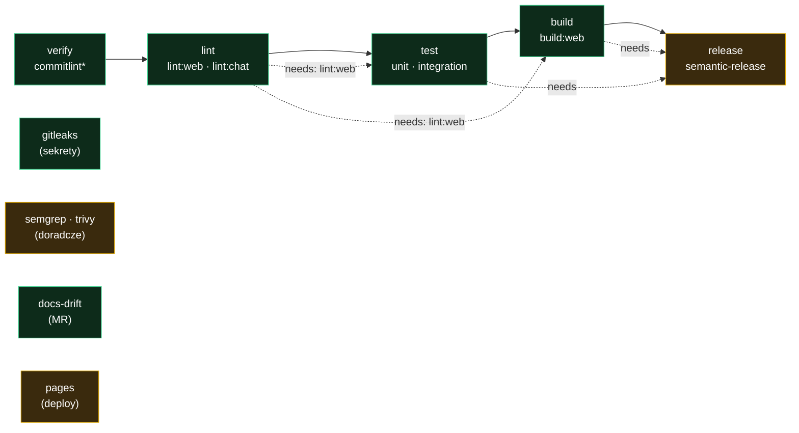

# Utrzymanie i operacje (MAINTENANCE)

Runbook dla **maintainerów** repozytorium `ghost-empire`. Opisuje, jak działa
infrastruktura CI/CD, jak wydawać wersje, jak reagować na skany bezpieczeństwa,
jak aktualizować zależności i co zrobić, gdy coś się zepsuje. Dokument jest
efektem profesjonalizacji repo (ETAP 0–5) i stanowi jej domknięcie.

> **TL;DR dla nowego maintainera:** źródłem prawdy jest **GitLab**. Pracujesz na
> gałęzi od `main` → Merge Request → zielony pipeline → merge. Przed wysłaniem
> `cd ghost-empire-web && npm run verify-all`. Wersje wydają się automatycznie z Conventional Commits.
> Nigdy nie dodawaj `.github/workflows/` (GitHub Actions w tym repo nie działa).

---

## 1. Model hostingu — GitLab = źródło prawdy, GitHub = mirror

| Platforma | Rola | Uwagi |
|---|---|---|
| **GitLab** (`gitlab.com/Gh0s777tt/ghost-empire`) | **źródło prawdy** | Cały pipeline CI/CD, Pages, wydania, Renovate. |
| **GitHub** (`github.com/Gh0s777tt/ghost-empire`) | **mirror (read-only)** | Publiczna widoczność. **Nie** uruchamiaj tu CI. |

**Dlaczego tak:** GitHub Actions jest wyłączone na koncie właściciela (joby padają
w kilka sekund z zerem kroków). Cały pipeline żyje więc w GitLab CI. **Twarda
zasada:** nigdy nie twórz plików w `.github/workflows/` — nie zadziałają.

**Publikacja na obie platformy** (dopóki nie stoi automatyczny mirror):

```bash
git push gitlab main      # źródło prawdy — pipeline rusza tutaj
git push origin main      # mirror na GitHub
```

**Docelowy mirror push** (GitLab → GitHub, automatyczny) czeka na jednorazową
akcję właściciela: utworzenie **GitHub PAT** (scope `repo`) i wklejenie go w
GitLab → *Settings → Repository → Mirroring repositories*. Token wprowadza
**właściciel** (zob. opis w akapicie powyżej). Po skonfigurowaniu wystarczy
`git push gitlab main`, a GitHub zaktualizuje się sam.

---

## 2. Pipeline CI/CD — jak działa

Definicja: [`.gitlab-ci.yml`](https://gitlab.com/Gh0s777tt/ghost-empire/-/blob/main/.gitlab-ci.yml). Uruchamia się **tylko** dla
Merge Requestów, gałęzi domyślnej (`main`) i harmonogramów — push do zwykłej
gałęzi bez MR **nie** odpala CI (`workflow.rules`).



<sub>🟢 twarde bramki (blokują merge): commitlint*, lint, test, build, **gitleaks**, **docs-drift**.
🟠 nie-blokujące: semgrep/trivy (doradcze), release (bootstrap), pages (deploy po merge). Skany i docs
mają `needs: []` — startują równolegle. \* `commitlint` biegnie **wyłącznie na MR**.</sub>

### Joby i bramki

| Job | Stage | Bramka | Kiedy biegnie | Co robi |
|---|---|---|---|---|
| `commitlint` | verify | 🔴 twarda | **MR** | Waliduje komunikaty commitów (Conventional Commits). |
| `lint:web` | lint | 🔴 twarda | MR + main | `typecheck` · `lint` (eslint) · `docs:check`. |
| `lint:chat` | lint | 🔴 twarda | MR + main | `typecheck` (bot). |
| `test:unit:web` | test | 🔴 twarda | MR + main | `test:coverage` (vitest, bez bazy). Badge coverage. |
| `test:integration:web` | test | 🔴 twarda | MR + main | Realny **Postgres 16** (service) + `prisma db push` + testy integracyjne. |
| `build:web` | build | 🔴 twarda | MR + main | `next build` (env-stuby; build nie sięga bazy). |
| `gitleaks` | security | 🔴 **twarda** | MR + main + schedule | Skan sekretów w drzewie roboczym. |
| `semgrep` | security | 🟠 doradcza | MR + main + schedule | SAST (`p/ci` + `p/typescript`). `allow_failure`. |
| `trivy` | security | 🟠 doradcza | MR + main + schedule | CVE w zależnościach. `allow_failure`. |
| `pages` | docs | — | main | Buduje MkDocs + TypeDoc → GitLab Pages. `needs: []`. |
| `docs-drift` | docs | 🔴 twarda | MR | Failuje MR, gdy zmieniono trasy `/api/*` bez `docs/`. |
| `release` | release | 🟠 bootstrap | main | `semantic-release`. `allow_failure` do czasu setupu (§4). |
| `renovate` | security | 🟠 | schedule `RENOVATE=true` | Otwiera MR-y z aktualizacjami zależności. |

**Twarda bramka** = jej porażka **czerwieni** pipeline. **Doradcza** (`allow_failure:
true`) = porażka daje **pomarańczowe ostrzeżenie**, nie blokuje merge'a. To świadomy
kompromis — zob. §6.

### Egzekwowanie bramek na MR
Bramki są *blokujące* dopiero, gdy właściciel włączy **Settings → Merge requests →
„Pipelines must succeed"** oraz ochronę gałęzi `main` (§10). Bez tego można ominąć
CI bezpośrednim pushem do `main`.

---

## 3. Codzienna praca nad kodem

1. Gałąź od `main`: `git switch -c feat/nazwa`.
2. Kodujesz. Przed commitem lokalne bramki odpalają się same (lefthook, §5).
3. Commit w konwencji [Conventional Commits](https://www.conventionalcommits.org/)
   (`feat:`, `fix:`, `docs:`, `refactor:`, `chore:`…). Typ steruje wersją (§4).
4. Push i otwórz **Merge Request** (szablon: [`.gitlab/merge_request_templates/Default.md`](https://gitlab.com/Gh0s777tt/ghost-empire/-/blob/main/.gitlab/merge_request_templates/Default.md)).
5. Poczekaj na **zielony pipeline**, rozwiąż wątki, zmerguj.
6. Po merge do `main`: uruchamia się `release` (wersja) i `pages` (dokumentacja).

**Bramka lokalna przed pushem (zalecana):**

```bash
cd ghost-empire-web
npm run verify-all         # typecheck · lint · docs:check · testy unit + integracyjne (stawia jednorazowy Postgres)
npm run verify-all -- --fast   # to samo bez integracji/bazy (szybkie, jak pre-push)
```

---

## 4. Wydawanie wersji (semantic-release)

Konfiguracja: [`.releaserc.json`](https://gitlab.com/Gh0s777tt/ghost-empire/-/blob/main/.releaserc.json) + root [`package.json`](https://gitlab.com/Gh0s777tt/ghost-empire/-/blob/main/package.json).
Po każdym merge do `main` job `release` analizuje **Conventional Commits** od
ostatniego tagu i — jeśli są zmiany warte wydania — **automatycznie**: podbija
wersję (SemVer), tworzy tag `vX.Y.Z`, publikuje Release na GitLab i dopisuje sekcję
do [`CHANGELOG.md`](https://gitlab.com/Gh0s777tt/ghost-empire/-/blob/main/CHANGELOG.md) (commit zwrotny z `[skip ci]`).

| Typ commita | Efekt na wersję | Sekcja w CHANGELOG |
|---|---|---|
| `fix:` | patch (`x.y.Z`) | Fixed |
| `feat:` | minor (`x.Y.0`) | Added |
| `perf:` / `refactor:` / `revert:` | patch | Changed |
| `feat!:` lub `BREAKING CHANGE:` w stopce | **major** (`X.0.0`) | Added + notka o zmianie łamiącej |
| `docs:` / `chore:` / `ci:` / `test:` / `build:` / `style:` | brak wydania | ukryte |

### Jednorazowy setup wydań (wymagany, w tej kolejności)
Dopóki nie wykonasz poniższego, job `release` daje **pomarańczowe ostrzeżenie**
(`allow_failure`) i nic nie wydaje — to nie jest błąd, to bootstrap-guard.

1. **Root lockfile:** w katalogu `ghost-empire/` uruchom `npm install` i **zacommituj**
   `package.json` + `package-lock.json` (job `release` używa `npm ci`). Przy okazji
   `npm install` zainstaluje git-hooki (skrypt `prepare` → `lefthook install`).
2. **Zmienna `GITLAB_TOKEN`** (Settings → CI/CD → Variables): GitLab PAT / Project
   Access Token roli **Maintainer**, scope `api`, **Masked + Protected**. Potrzebny do
   tagu, Release'u i pushu CHANGELOG na chronioną `main`.
3. **Tag bazowy:** repo ma 0 tagów → bez bazy pierwsze wydanie wyszłoby jako `1.0.0`.
   Aby zacząć od `0.1.0`: `git tag v0.1.0 && git push gitlab v0.1.0`.
4. **Po pierwszym udanym wydaniu:** usuń `allow_failure: true` z joba `release` w
   `.gitlab-ci.yml`, żeby wydania stały się autorytatywne.

> ⚠️ **Napięcie CHANGELOG:** nagłówek `CHANGELOG.md` deklaruje „wersje kalendarzowe",
> a semantic-release używa **SemVer**. `changelogTitle` w `.releaserc.json` jest
> dokładną kopią obecnego nagłówka — jeśli zmienisz nagłówek, zsynchronizuj oba,
> inaczej wtyczka zdubluje nagłówek. Historyczny, ręcznie prowadzony format
> `[Unreleased]` pozostaje; nowe sekcje semantic-release dokłada pod tytułem.

**Podgląd bez publikacji:** `npm run release:dry` (w korzeniu).

---

## 5. Lokalne git-hooki (lefthook)

Konfiguracja: [`lefthook.yml`](https://gitlab.com/Gh0s777tt/ghost-empire/-/blob/main/lefthook.yml) + [`commitlint.config.js`](https://gitlab.com/Gh0s777tt/ghost-empire/-/blob/main/commitlint.config.js).
Instalują się przez `npm install` w **korzeniu** repo (skrypt `prepare`), albo ręcznie
`npx lefthook install`.

| Hook | Działanie | Ominięcie |
|---|---|---|
| `pre-commit` | `eslint --fix` na zmienionych plikach web | `git commit --no-verify` |
| `commit-msg` | commitlint (Conventional Commits) | `git commit --no-verify` |
| `pre-push` | `verify-all:fast` (web) + `typecheck` (chat) | `git push --no-verify` |

Hooki to *szybka* bramka lokalna — **CI w GitLab jest źródłem prawdy** i tak
zweryfikuje wszystko ponownie (commitlint na MR również serwerowo).

> Po pierwszym `npm install` w korzeniu lefthook przejmie `.git/hooks/*` i
> zarchiwizuje istniejący ręczny `.git/hooks/pre-push` jako `.old` — usuń archiwum.
> Wersjonowany `ghost-empire-web/scripts/hooks/pre-push` staje się zbędny.

---

## 6. Bezpieczeństwo — skany i reakcja

Skanery są **samodzielne** (bez szablonów `Security/*.gitlab-ci.yml`, które są kruche:
nadpisywanie ich jobów po nazwie unieważnia cały YAML, gdy GitLab zmieni nazwę
analizatora). Obrazy są **przypięte wersjami** dla reprodukowalności.

### `gitleaks` — sekrety (TWARDA bramka)
Skanuje bieżące drzewo (`--no-git`) z allowlistą [`.gitleaks.toml`](https://gitlab.com/Gh0s777tt/ghost-empire/-/blob/main/.gitleaks.toml)
(placeholdery w `*.env.example`, `tenants/*.env`). **Gdy zgłosi sekret:**
1. Jeśli **prawdziwy** — natychmiast **zrotuj** go u dostawcy (nie tylko usuń z kodu;
   historia git go pamięta), potem usuń z drzewa i użyj zmiennej środowiskowej.
2. Jeśli **placeholder / false-positive** — dodaj ścieżkę lub regex do allowlisty w
   `.gitleaks.toml` (nie wyłączaj całego joba).

> `gitleaks` skanuje tylko **bieżące drzewo**, nie pełną historię git. Sekret
> zakopany w starej historii nie zostanie złapany przez CI — bezpieczeństwo historii
> zależy od rotacji (§7).

### `semgrep` (SAST) i `trivy` (CVE) — DORADCZE
Są `allow_failure: true`, bo na realnym drzewie Next 16 / npm **niemal zawsze** coś
zgłoszą; twarda bramka blokowałaby całą pracę. Findings dają **pomarańczowe
ostrzeżenie**, nie fałszywy zielony. **Triaż (docelowo):**
- Przejrzyj findings w logu joba (`semgrep` / `trivy`).
- Realne → napraw. Zaakceptowane CVE → dodaj do `.trivyignore`. Reguły semgrep z
  false-positive → dostosuj `--config`.
- Gdy szum opanowany → **usuń `allow_failure`**, żeby stały się twardymi bramkami.

Zgłaszanie podatności: [`SECURITY.md`](https://gitlab.com/Gh0s777tt/ghost-empire/-/blob/main/SECURITY.md).

---

## 7. Rotacja sekretów

Sekrety **nigdy** nie trafiają do kodu ani do repo — tylko do zmiennych środowiskowych
(Vercel dla aplikacji, GitLab CI/CD Variables dla pipeline'u). `.env.local` jest
`.gitignore`. Przy podejrzeniu ekspozycji (np. wklejenie do czatu, log, screenshot):
**zrotuj u dostawcy**, potem zaktualizuj zmienną w Vercel/GitLab. Dotyczy m.in.:
Stripe (`sk`/`rk`), GitHub/GitLab PAT, Vercel, Supabase, Upstash, klucze AI,
`NEXTAUTH_SECRET`, `BOT_SECRET`. Pełna lista i status — zob. [dokument audytu](audit/AUDIT-2026-07-13.md).

---

## 8. Aktualizacje zależności (Renovate)

Konfiguracja: [`renovate.json`](https://gitlab.com/Gh0s777tt/ghost-empire/-/blob/main/renovate.json). Renovate (self-hosted, job
`renovate` na dedykowanym harmonogramie) otwiera **MR-y** z aktualizacjami wprost w
GitLab. Dependabot działa tylko na GitHubie (mirror) → jego PR-y nie trafiają do
źródła prawdy; po potwierdzeniu, że Renovate działa, usuń `.github/dependabot.yml`.

- **Grupowanie:** minor+patch npm w jeden MR; **major** osobno (do przeglądu).
- **Dashboard:** issue „Renovate Dependency Dashboard" zbiera wszystkie oczekujące.
- **Prisma** (`prisma` / `@prisma/client` / `@prisma/adapter-pg`) i obrazy CI/Docker
  są grupowane, żeby wersje szły w parze.
- **Node** trzymany na `<23` (projekt celuje w Node 22).
- Wymaga zmiennej **`RENOVATE_TOKEN`** (GitLab PAT, scope `api` + `write_repository`).

---

## 9. Dokumentacja jako kod (MkDocs + TypeDoc)

Konfiguracja: [`mkdocs.yml`](https://gitlab.com/Gh0s777tt/ghost-empire/-/blob/main/mkdocs.yml) + [`ghost-empire-web/typedoc.json`](https://gitlab.com/Gh0s777tt/ghost-empire/-/blob/main/ghost-empire-web/typedoc.json).

- **Treść** — Markdown w `docs/`. Nawigacja w `mkdocs.yml` (plugin `awesome-pages`).
- **Referencja API** — `npm run docs:api` (TypeDoc) generuje `docs/api/*.md` z kodu
  `lib/` (regenerowane w CI, `.gitignore`d).
- **Publikacja** — job `pages` buduje serwis przy każdym merge do `main` i wystawia
  na **https://gh0s777tt.gitlab.io/ghost-empire/** (`pages: needs: []`, niezależnie od skanów).
- **Anty-drift** — job `docs-drift` failuje MR, gdy zmieniono trasy `/api/*` bez
  aktualizacji `docs/`.

**Podgląd lokalny:**
```bash
pip install mkdocs-material mkdocs-awesome-pages-plugin
cd ghost-empire-web && npm run docs:api && cd ..
mkdocs serve                 # http://127.0.0.1:8000
```

---

## 10. Zmienne CI/CD i ochrona `main` (akcje właściciela)

**Settings → CI/CD → Variables:**

| Zmienna | Scope | Ustawienia | Do czego |
|---|---|---|---|
| `GITLAB_TOKEN` | `api` | Masked + **Protected** | Job `release` (tag/Release/CHANGELOG). |
| `RENOVATE_TOKEN` | `api` + `write_repository` | Masked | Job `renovate` (otwiera MR-y). |
| `GITHUB_COM_TOKEN` | `public_repo` (read) | Masked, opcjonalny | Renovate: release-notes z GitHub bez rate-limitu. |

**Settings → Repository → Protected branches → `main`:** „Allowed to force push" =
**OFF**; merge tylko przez MR; dla release dodaj token/bota roli Maintainer do
„Allowed to push". **Settings → Merge requests:** włącz „Pipelines must succeed"
(+ „All threads resolved").

**Build → Pipeline schedules** (dwa osobne):
| Harmonogram | Cron (przykład) | Zmienna | Efekt |
|---|---|---|---|
| Nocny skan | `0 3 * * *` | — | Uruchamia **tylko** skany (gitleaks/semgrep/trivy) na `main` — nowe CVE. |
| Renovate | `0 5 * * 1` | `RENOVATE=true` | Uruchamia **tylko** job `renovate`. |

<sub>Izolacja harmonogramów jest wymuszona regułami: joby `lint`/`test`/`build`/`release`/`pages`
mają w regule `&& $CI_PIPELINE_SOURCE != "schedule"`, więc żaden scheduled pipeline ich nie odpala
(w szczególności `release` **nie** wyda wersji z nocnego skanu).</sub>

---

## 11. Runbook — gdy coś padnie

| Objaw | Diagnoza / działanie |
|---|---|
| **Czerwony pipeline na `main`** | Otwórz pipeline → który job „Failed" (nie „Warning")? Warning = doradczy skan (OK). Failed twardego joba: przeczytaj log, odtwórz lokalnie (`cd ghost-empire-web && npm run verify-all`). |
| **`test:integration:web` pada** | Usługa Postgres nie wstała lub schema wymaga rozszerzenia PG spoza `postgres:16`. Sprawdź log `pg_isready`; w razie potrzeby włącz rozszerzenie przed `db push`. |
| **`build:web` pada** | Runner offline (fonty `next/font/google` pobierają się z sieci) lub nowa strona sięga bazy w czasie buildu (`generateStaticParams`). Dodaj brakujące env-stuby lub oznacz stronę `dynamic`. |
| **`gitleaks` na czerwono** | Prawdziwy sekret → rotacja (§6/§7). False-positive → allowlist w `.gitleaks.toml`. |
| **Pages nie publikują** | Job `pages` biegnie tylko na `main`. Sprawdź, czy Pages jest włączone (Deploy → Pages) i czy `docs:api` + `mkdocs build` przeszły. |
| **`release` nie tworzy wersji** | Brak `GITLAB_TOKEN` / tagu bazowego / root locka (§4), albo brak commitów `feat:`/`fix:` od ostatniego tagu. |
| **Złe wydanie trafiło na `main`** | `git revert` wadliwych commitów → merge → semantic-release wyda kolejny patch naprawczy (nie przepisuj historii). Błędny tag/Release można usunąć/oznaczyć w GitLab (wymaga `GITLAB_TOKEN` roli Maintainer). |
| **Bot nie odpowiada na czacie** | `ghost-empire-chat` to **osobny runtime** (`tsx src/index.ts`) hostowany poza tym repo — restart i logi po stronie hostingu bota; sekret `BOT_SECRET`. To repo obejmuje bota tylko w CI (`lint:chat`). |
| **`commitlint` czerwieni MR** | Komunikat nie trzyma Conventional Commits — popraw (`git commit --amend`) lub zrób rebase. Dozwolone typy: `commitlint.config.js`. |
| **Coverage badge pusty** | Reporter `text-summary` + regex `Statements : NN%` w jobie `test:unit:web`. Zmiana reportera vitest wymaga aktualizacji regexu. |

---

## 12. Mapa profesjonalizacji (ETAP 0–5)

| ETAP | Rezultat | Gdzie |
|---|---|---|
| 0 | Inwentaryzacja + model GitLab↔GitHub, push mirror | ten dokument §1 |
| 1 | Audyt 100% (jakość/perf/security/organizacja), 56 findings + remediacja | [`docs/audit/AUDIT-2026-07-13.md`](audit/AUDIT-2026-07-13.md) |
| 2 | README od zera + banner SVG (light/dark) + LICENSE | [`README.md`](https://gitlab.com/Gh0s777tt/ghost-empire/-/blob/main/README.md) |
| 3 | Docs-as-code: MkDocs Material + TypeDoc + Pages + docs-drift | §9, [`mkdocs.yml`](https://gitlab.com/Gh0s777tt/ghost-empire/-/blob/main/mkdocs.yml) |
| 4 | Pipeline CI/CD + semantic-release + Renovate + lefthook + skany | §2–§8, [`.gitlab-ci.yml`](https://gitlab.com/Gh0s777tt/ghost-empire/-/blob/main/.gitlab-ci.yml) |
| 5 | Ten runbook | `docs/MAINTENANCE.md` |

**Stos technologiczny:** Next.js 16 (App Router, React 19) · TypeScript · Prisma 7
(driver-adapter `@prisma/adapter-pg`, konfiguracja w `prisma.config.ts`) · Postgres
(Supabase) · Tailwind 4 · NextAuth · next-intl · bot `ghost-empire-chat` (Node + tmi.js + tsx).
Node **≥ 22**. Menedżer pakietów: **npm** (`.npmrc`: `legacy-peer-deps=true`).
