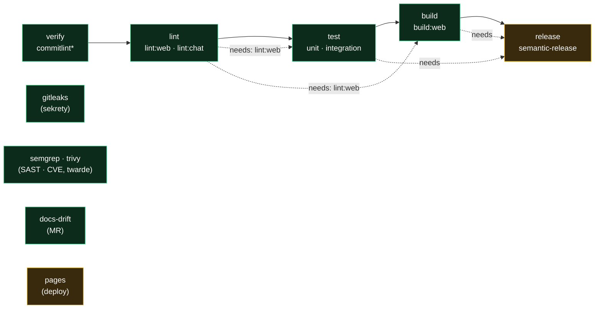

# Utrzymanie i operacje (MAINTENANCE)

Runbook dla **maintainerów** repozytorium `ghost-empire`. Opisuje, jak działa
infrastruktura CI/CD, jak wydawać wersje, jak reagować na skany bezpieczeństwa,
jak aktualizować zależności i co zrobić, gdy coś się zepsuje. Dokument jest
efektem profesjonalizacji repo (ETAP 0–5) i stanowi jej domknięcie.

> **TL;DR dla nowego maintainera:** źródłem prawdy jest **GitLab**. Pracujesz na
> gałęzi od `main` → Merge Request → zielony pipeline → merge. Przed wysłaniem
> `cd ghost-empire-web && npm run verify-all`. Wersje **docelowo** wydaje semantic-release
> z Conventional Commits — ale **żadne wydanie jeszcze nie wyszło**; do pierwszego brakuje
> akcji właściciela (§4). Nigdy nie dodawaj `.github/workflows/` (GitHub Actions w tym repo nie działa).

---

## 1. Model hostingu — GitLab = źródło prawdy, GitHub = mirror

| Platforma | Rola | Uwagi |
|---|---|---|
| **GitLab** (`gitlab.com/Gh0s777tt/ghost-empire`) | **źródło prawdy** | Cały pipeline CI/CD, Pages, wydania, Renovate. |
| **GitHub** (`github.com/Gh0s777tt/ghost-empire`) | **mirror (read-only)** | Publiczna widoczność. **Nie** uruchamiaj tu CI. |

**Dlaczego tak:** GitHub Actions jest wyłączone na koncie właściciela (joby padają
w kilka sekund z zerem kroków). Cały pipeline żyje więc w GitLab CI. **Twarda
zasada:** nigdy nie twórz plików w `.github/workflows/` — nie zadziałają.

**Publikacja na obie platformy** (dopóki nie stoi automatyczny mirror):

```bash
git push gitlab main      # źródło prawdy — pipeline rusza tutaj
git push origin main      # mirror na GitHub
```

**Docelowy mirror push** (GitLab → GitHub, automatyczny) czeka na jednorazową
akcję właściciela: utworzenie **GitHub PAT** (scope `repo`) i wklejenie go w
GitLab → *Settings → Repository → Mirroring repositories*. Token wprowadza
**właściciel** (zob. opis w akapicie powyżej). Po skonfigurowaniu wystarczy
`git push gitlab main`, a GitHub zaktualizuje się sam.

---

## 2. Pipeline CI/CD — jak działa

Definicja: [`.gitlab-ci.yml`](https://gitlab.com/Gh0s777tt/ghost-empire/-/blob/main/.gitlab-ci.yml). Uruchamia się **tylko** dla
Merge Requestów, gałęzi domyślnej (`main`) i harmonogramów — push do zwykłej
gałęzi bez MR **nie** odpala CI (`workflow.rules`).


```mermaid
flowchart LR
  V["verify<br/>commitlint*"] --> L["lint<br/>lint:web · lint:chat"]
  L --> T["test<br/>unit · integration"]
  T --> B["build<br/>build:web"]
  B --> R["release<br/>semantic-release"]
  SG["gitleaks<br/>(sekrety)"]
  SS["semgrep · trivy<br/>(SAST · CVE, twarde)"]
  DD["docs-drift<br/>(MR)"]
  DP["pages<br/>(deploy)"]
  L -.->|needs: lint:web| T
  L -.->|needs: lint:web| B
  T -.->|needs| R
  B -.->|needs| R
  classDef hard fill:#0d2b1a,stroke:#3fcf8e,color:#fff;
  classDef soft fill:#3a2a0d,stroke:#e0a800,color:#fff;
  class V,L,T,B,SG,SS,DD hard;
  class R,DP soft;
```

<sub>🟢 twarde bramki (blokują merge): commitlint*, lint, test, build, **gitleaks**, **semgrep**,
**trivy**, **docs-drift**. 🟠 nie-blokujące: release (bootstrap), pages (deploy po merge). Skany i docs
mają `needs: []` — startują równolegle. \* `commitlint` biegnie **wyłącznie na MR**.</sub>

### Joby i bramki

| Job | Stage | Bramka | Kiedy biegnie | Co robi |
|---|---|---|---|---|
| `commitlint` | verify | 🔴 twarda | **MR** | Waliduje komunikaty commitów (Conventional Commits). |
| `lint:web` | lint | 🔴 twarda | MR + main | `typecheck` · `lint` (eslint) · `docs:check` · `docs:env` · `docs:i18n` · `docs:i18n:dup`. |
| `lint:chat` | lint | 🔴 twarda | MR + main | `typecheck` · **`lint:brand`** (bot) — bramka white-label: chodzi po **AST TypeScripta** i failuje, gdy founderowy literał („Ghost Tokens", „GT", „Ghost Empire", handle/Discord właściciela) trafi do stringa/templata, który może wyjść na czat. Komentarze, `console.*`, placeholder `%gt%` i `__tests__` są świadomie pomijane; wyjątek przez `// wl-ok: <powód>`. **Grep by tu nie wystarczył** — większość surowych trafień w `src/` to komentarze, a copy dla widza jest **argumentem wywołania** (`broadcast(…)`), nie `field: "literal"`. |
| `test:chat` | test | 🔴 twarda | MR + main | `npm test` (bot) — wbudowany runner **`node:test`** przez tsx, **bez vitesta** (dev-tooling bota to tylko tsx + tsc, nie dokładamy tam zależności). Pilnuje inwariantów `src/branding.ts`: awaria portalu → neutralne „tokeny", **nigdy** „GT". |
| `test:unit:web` | test | 🔴 twarda | MR + main | `test:coverage` (vitest, bez bazy). Badge coverage. |
| `test:integration:web` | test | 🔴 twarda | MR + main | Realny **Postgres 16** (service) + `prisma db push` + testy integracyjne. |
| `build:web` | build | 🔴 twarda | MR + main | `next build` (env-stuby; build nie sięga bazy). |
| `gitleaks` | security | 🔴 **twarda** | MR + main + schedule | Skan sekretów w drzewie roboczym (`--no-git`), allowlista w `.gitleaks.toml`. |
| `semgrep` | security | 🔴 **twarda** | MR + main + schedule | SAST (`p/ci` + `p/typescript`). `allow_failure` **zdjęte** (audyt 2026-08). |
| `trivy` | security | 🔴 **twarda** | MR + main + schedule | CVE w zależnościach (`fs --scanners vuln`, **jeden cel na wywołanie** — po jednym przebiegu na `ghost-empire-web` i `ghost-empire-chat`). HIGH/CRITICAL czerwieni job, LOW/MEDIUM informacyjnie; `allow_failure` **zdjęte** (audyt 2026-08). |
| `pages` | docs | — | main | Buduje MkDocs + TypeDoc → GitLab Pages. `needs: []`. |
| `docs-drift` | docs | 🔴 twarda | MR | Failuje MR, gdy zmieniono trasy `/api/*` bez `docs/`. |
| `release` | release | 🟠 bootstrap | main | `semantic-release`. `allow_failure` do czasu setupu (§4). |
| `renovate` | security | 🟠 | schedule `RENOVATE=true` | Otwiera MR-y z aktualizacjami zależności. |

**Twarda bramka** = jej porażka **czerwieni** pipeline. **Doradcza** (`allow_failure:
true`) = porażka daje **pomarańczowe ostrzeżenie**, nie blokuje merge'a. Wszystkie trzy
skanery bezpieczeństwa są dziś **twarde** — zob. §6.

### Egzekwowanie bramek na MR
Bramki są *blokujące* dopiero, gdy właściciel włączy **Settings → Merge requests →
„Pipelines must succeed"** oraz ochronę gałęzi `main` (§10). Bez tego można ominąć
CI bezpośrednim pushem do `main`.

---

## 3. Codzienna praca nad kodem

1. Gałąź od `main`: `git switch -c feat/nazwa`.
2. Kodujesz. Przed commitem lokalne bramki odpalają się same (lefthook, §5).
3. Commit w konwencji [Conventional Commits](https://www.conventionalcommits.org/)
   (`feat:`, `fix:`, `docs:`, `refactor:`, `chore:`…). Typ steruje wersją (§4).
4. Push i otwórz **Merge Request** (szablon: [`.gitlab/merge_request_templates/Default.md`](https://gitlab.com/Gh0s777tt/ghost-empire/-/blob/main/.gitlab/merge_request_templates/Default.md)).
5. Poczekaj na **zielony pipeline**, rozwiąż wątki, zmerguj.
6. Po merge do `main`: uruchamia się `release` (wersja) i `pages` (dokumentacja).

**Bramka lokalna przed pushem (zalecana):**

```bash
cd ghost-empire-web
npm run verify-all         # typecheck · lint · docs:check · docs:env · docs:i18n · testy unit + integracyjne (stawia jednorazowy Postgres)
npm run verify-all -- --fast   # to samo bez integracji/bazy (szybkie, jak pre-push)
```

### Higiena gałęzi (stan: audyt 2026-08 — czeka na przegląd właściciela)

Przestrzeń refów przestała odróżniać żywą pracę od historii: z **48** gałęzi historycznych
(poza `main` i bieżącą gałęzią audytu `fix/audit-2026-08`)
aż **40 jest w całości zmergowanych** do `main`, ale nigdy nie skasowanych (lokalnie
i jako refy zdalne na `origin`/`gitlab`), a **8 gałęzi `claude/*` niesie niezmergowane
commity** — wszystkie nietknięte od 2026-07-24/25, przetrwały całą falę #805–#817.
To ta sama klasa problemu, którą AUDIT_REPORT.md wytknął dla `origin/imgbot`
(„wisi bez PR-decyzji") i która nigdy nie została zaadresowana.

| Gałąź (niezmergowana) | commitów przed `main` |
|---|---|
| `claude/determined-blackwell-82da8f` | 5 |
| `claude/vibrant-jang-4aa4a4` | 3 |
| `claude/heuristic-feynman-d4b2b2` | 2 |
| `claude/hungry-ritchie-ce69af` | 2 |
| `claude/wonderful-yalow-f55899` | 2 |
| `claude/festive-golick-43880a` | 1 |
| `claude/jolly-lederberg-153dcd` | 1 |
| `claude/zen-goodall-a5456f` | 1 |

**Dlaczego audyt niczego tu sam nie skasował:** każda z 8 gałęzi to potencjalnie
wartościowa, niedokończona praca — „zmergować czy porzucić" wymaga oceny właściciela,
a kasowanie refów jest destrukcyjne (odzysk tylko przez reflog, do czasu `gc`).

**Procedura sprzątania (właściciel):**

```bash
# 1) Przejrzyj, co niesie każda niezmergowana gałąź (przykład):
git log --oneline main..claude/determined-blackwell-82da8f
#    wartościowe → gałąź od main + MR; martwe → skasuj jak w (2).

# 2) Gałęzie zmergowane — kasowanie bezpieczne (git branch -d ODMÓWI przy niezmergowanej):
git branch --merged main | grep -vE '^\*|^\s*main$' | xargs -r -n1 git branch -d
#    i po stronie zdalnej (dla każdego remote'a):
git push origin --delete <gałąź>

# 3) Na przyszłość: przy merge'u MR-a zaznaczaj „Delete source branch"
#    (Settings → Merge requests → „Enable 'Delete source branch' option by default"),
#    żeby lista nie odrastała.
```

---

## 4. Wydawanie wersji (semantic-release)

Konfiguracja: [`.releaserc.json`](https://gitlab.com/Gh0s777tt/ghost-empire/-/blob/main/.releaserc.json) + root [`package.json`](https://gitlab.com/Gh0s777tt/ghost-empire/-/blob/main/package.json).

> ⚠️ **Stan faktyczny (audyt 2026-08): ten mechanizm NIE wydał dotąd ANI JEDNEGO wydania.**
> Dowód w historii repo: 1000+ commitów, dokładnie **jeden** tag (`v0.1.0`, założony **ręcznie**
> 2026-07-16) i **zero** commitów `chore(release):`. Wcześniejsza wersja tego rozdziału (i TL;DR)
> opisywała wydania jako działający automat — to była nieprawda: job `release` fizycznie nie mógł
> się wykonać (brak root `package-lock.json` → `npm ci` twardo failował; głębiej: niespełnialny
> zakres `@semantic-release/commit-analyzer`), a `allow_failure: true` maskował awarię jako
> „pomarańczowy bootstrap". Obie przyczyny są już usunięte. **Autorytatywna diagnoza i pełna
> procedura włączenia wydań** żyje w komentarzu nad jobem `release` w
> [`.gitlab-ci.yml`](https://gitlab.com/Gh0s777tt/ghost-empire/-/blob/main/.gitlab-ci.yml)
> (sekcja „RELEASE" — łącznie z precheckiem, który przy braku lockfile'a mówi *co* naprawić,
> zamiast wywalać się generycznym błędem npm).

**Docelowe działanie** (gdy setup niżej zostanie domknięty): po każdym merge do `main` job
`release` analizuje **Conventional Commits** od ostatniego tagu i — jeśli są zmiany warte
wydania — podbija wersję (SemVer), tworzy tag `vX.Y.Z`, publikuje Release na GitLab i dopisuje
sekcję do [`CHANGELOG.md`](https://gitlab.com/Gh0s777tt/ghost-empire/-/blob/main/CHANGELOG.md) (commit zwrotny z `[skip ci]`).

| Typ commita | Efekt na wersję | Sekcja w CHANGELOG |
|---|---|---|
| `fix:` | patch (`x.y.Z`) | Fixed |
| `feat:` | minor (`x.Y.0`) | Added |
| `perf:` / `refactor:` / `revert:` | patch | Changed |
| `feat!:` lub `BREAKING CHANGE:` w stopce | **major** (`X.0.0`) | Added + notka o zmianie łamiącej |
| `docs:` / `chore:` / `ci:` / `test:` / `build:` / `style:` | brak wydania | ukryte |

### Jednorazowy setup wydań (stan po audycie 2026-08)
Dopóki lista nie jest domknięta, job `release` daje **pomarańczowe ostrzeżenie**
(`allow_failure`) i nic nie wydaje — to bootstrap-guard, nie błąd. Wersją autorytatywną
tej listy jest komentarz nad jobem `release` w `.gitlab-ci.yml`; poniżej stan na 2026-08:

1. ✅ **Root lockfile** — `package-lock.json` wygenerowany i zacommitowany (wcześniej
   **nie istniał**, przez co `npm ci` twardo failował i `semantic-release` nigdy nie
   wystartował — to była główna przyczyna zera wydań). Pierwsze `npm install` w korzeniu
   instaluje też git-hooki (skrypt `prepare` → `lefthook install`).
2. ⬜ **Zmienna `GITLAB_TOKEN`** (Settings → CI/CD → Variables): GitLab PAT / Project
   Access Token roli **Maintainer**, scope `api`, **Masked + Protected**. Potrzebny do
   tagu, Release'u i pushu CHANGELOG na chronioną `main`. **Tylko właściciel** może ją
   ustawić — z poziomu repo się nie da.
3. ✅ **Tag bazowy** — `v0.1.0` istnieje (założony ręcznie 2026-07-16); bez niego
   pierwsze wydanie wyszłoby jako `1.0.0`.
4. ⬜ **Decyzja o `CHANGELOG.md`** — zob. ostrzeżenie o kolizji niżej. Po ustawieniu
   tokenu uruchom `npm run release:dry` i obejrzyj, co plugin faktycznie chce zrobić,
   **zanim** cokolwiek zostanie opublikowane.
5. ⬜ **Po pierwszym udanym wydaniu:** usuń `allow_failure: true` z joba `release` w
   `.gitlab-ci.yml`, żeby wydania stały się autorytatywne.

> ⚠️ **Kolizja z ręcznym CHANGELOG — decyzja właściciela przed pierwszym wydaniem**
> (audyt 2026-08, znalezisko „semantic-release koliduje z ręcznym changelogiem"):
> `CHANGELOG.md` to ręcznie pisany dokument (~800 KB, wpisy po 200–600 słów, żywa sekcja
> `## [Unreleased]`) i cel twardej bramki `docs:check`. `.releaserc.json` celuje pluginem
> `@semantic-release/changelog` w **ten sam plik**: pierwsze udane wydanie wstawi nad ręczną
> treścią maszynową sekcję `## [X.Y.Z]` z jednolinijkowymi skrótami tych samych PR-ów,
> a `[Unreleased]` zostawi nietknięte — dwa systemy opisywałyby te same zdarzenia w
> niekompatybilnych formatach, nieświadome siebie nawzajem. Do wyboru:
> **(a)** zaakceptować dokładanie sekcji nad ręcznym formatem i udokumentować punkt
> przejścia (tak zrobił E-Bot w `changelogTitle`), albo **(b)** wypiąć z `.releaserc.json`
> pluginy `@semantic-release/changelog` + `@semantic-release/git`, żeby release
> CHANGELOG-a w ogóle nie dotykał. Dopóki plugin zostaje: `changelogTitle` musi być
> dokładną kopią nagłówka pliku (deklarującego „wersje kalendarzowe" — semantic-release
> używa SemVer), inaczej wtyczka zdubluje nagłówek. Zawsze najpierw `npm run release:dry`.

**Podgląd bez publikacji:** `npm run release:dry` (w korzeniu).

---

## 5. Lokalne git-hooki (lefthook)

Konfiguracja: [`lefthook.yml`](https://gitlab.com/Gh0s777tt/ghost-empire/-/blob/main/lefthook.yml) + [`commitlint.config.js`](https://gitlab.com/Gh0s777tt/ghost-empire/-/blob/main/commitlint.config.js).
Instalują się przez `npm install` w **korzeniu** repo (skrypt `prepare`), albo ręcznie
`npx lefthook install`.

| Hook | Działanie | Ominięcie |
|---|---|---|
| `pre-commit` | `eslint --fix` na zmienionych plikach web | `git commit --no-verify` |
| `commit-msg` | commitlint (Conventional Commits) | `git commit --no-verify` |
| `pre-push` | `verify-all:fast` (web) + `typecheck` (chat) | `git push --no-verify` |

Hooki to *szybka* bramka lokalna — **CI w GitLab jest źródłem prawdy** i tak
zweryfikuje wszystko ponownie (commitlint na MR również serwerowo).

> Po pierwszym `npm install` w korzeniu lefthook przejmie `.git/hooks/*` i
> zarchiwizuje istniejący ręczny `.git/hooks/pre-push` jako `.old` — usuń archiwum.
> Wersjonowany `ghost-empire-web/scripts/hooks/pre-push` staje się zbędny.

---

## 6. Bezpieczeństwo — skany i reakcja

Skanery są **samodzielne** (bez szablonów `Security/*.gitlab-ci.yml`, które są kruche:
nadpisywanie ich jobów po nazwie unieważnia cały YAML, gdy GitLab zmieni nazwę
analizatora). Obrazy są **przypięte wersjami** dla reprodukowalności.

### `gitleaks` — sekrety (TWARDA bramka)
Skanuje bieżące drzewo (`--no-git`) z allowlistą [`.gitleaks.toml`](https://gitlab.com/Gh0s777tt/ghost-empire/-/blob/main/.gitleaks.toml)
(placeholdery w `*.env.example`, `tenants/*.env`). **Gdy zgłosi sekret:**
1. Jeśli **prawdziwy** — natychmiast **zrotuj** go u dostawcy (nie tylko usuń z kodu;
   historia git go pamięta), potem usuń z drzewa i użyj zmiennej środowiskowej.
2. Jeśli **placeholder / false-positive** — dodaj ścieżkę lub regex do allowlisty w
   `.gitleaks.toml` (nie wyłączaj całego joba). **Allowlista ma być WĄSKA:** wycisza się
   konkretną **wartość** (dosłowny regex), a nie regułę i nie cały plik — `paths` i
   `regexes` w jednym bloku `[allowlist]` łączy **OR**, więc dopisanie pliku do `paths`
   zdejmuje skan z CAŁEGO pliku. Po każdej zmianie allowlisty zrób **kontrolę pozytywną**:
   wstrzyknij atrapę sekretu do tego samego pliku i sprawdź, że job dalej jest czerwony
   (przykład: `ge-gambling-ack-v1` — nazwa klucza w `localStorage`, łapana przez
   `generic-api-key` po entropii; wyciszona sama wartość, reguła w tym pliku dalej działa).

> `gitleaks` skanuje tylko **bieżące drzewo**, nie pełną historię git. Sekret
> zakopany w starej historii nie zostanie złapany przez CI — bezpieczeństwo historii
> zależy od rotacji (§7).

### `semgrep` (SAST) i `trivy` (CVE) — TWARDE bramki
`allow_failure` zostało **zdjęte** (audyt 2026-08, decyzja właściciela): pojedynczy finding
**czerwieni cały pipeline**. Wcześniej były doradcze — dług „szumu" wytriażowano i zamknięto.
**Triaż:**
- Przejrzyj findings w logu joba (`semgrep` / `trivy`).
- **Realne → napraw u źródła.** Domyślne wyjście to poprawka, nie wyciszenie.
- **NIE przywracaj `allow_failure`** dla pojedynczego false-positive — to zaślepia CAŁY
  skaner i przywraca fałszywy zielony. Wycisz **punktowo** i zawsze z powodem: semgrep →
  inline `// nosemgrep: <rule-id>` albo wpis w `.semgrepignore`; trivy → jedna linia
  `CVE-XXXX-YYYY` w `.trivyignore` z komentarzem i datą przeglądu. Świadome odstępstwa →
  [`DECISIONS.md`](DECISIONS.md).

**`trivy fs` przyjmuje DOKŁADNIE JEDEN cel na wywołanie.** Dwa katalogi naraz kończą się
`FATAL Fatal error multiple targets cannot be specified` i **exit 1** — job jest wtedy
czerwony, choć nie przeskanował niczego. Dokładasz projekt → dokładasz **parę linii**
(przebieg informacyjny LOW/MEDIUM + bramkujący HIGH/CRITICAL), nie kolejny argument. Trivy
domyślnie **pomija dev-dependencies** (`--include-dev-deps` je pokazuje), więc zielony job
znaczy „brak HIGH/CRITICAL w zależnościach produkcyjnych".

> **Uwaga o regułach tekstowych:** część reguł (np. `npm-missing-minimum-release-age`)
> dopasowuje **surowy tekst pliku i nie pomija komentarzy** — opisanie w komentarzu
> „złej" wartości potrafi samo w sobie zapalić finding. Zob. komentarz-pułapkę w
> `ghost-empire-web/.npmrc`.

> **Czerwona bramka to nie zawsze finding.** Zanim uznasz job za „znalazł podatność",
> sprawdź w logu, czy nie padł na **błędzie konfiguracji** (zła składnia, brak celu) —
> albo na `ci_quota_exceeded` (wyczerpane minuty planu free) — wtedy nie chroni niczego,
> mimo że świeci na czerwono.

**Lokalne odtworzenie bramki** (zanim wypchniesz — ten sam config co CI):

```bash
semgrep scan --error --config p/ci --config p/typescript ghost-empire-web ghost-empire-chat
```

## 7. Rotacja sekretów

Sekrety **nigdy** nie trafiają do kodu ani do repo — tylko do zmiennych środowiskowych
(Vercel dla aplikacji, GitLab CI/CD Variables dla pipeline'u). `.env.local` jest
`.gitignore`. Przy podejrzeniu ekspozycji (np. wklejenie do czatu, log, screenshot):
**zrotuj u dostawcy**, potem zaktualizuj zmienną w Vercel/GitLab. Dotyczy m.in.:
Stripe (`sk`/`rk`), GitHub/GitLab PAT, Vercel, Supabase, Upstash, klucze AI,
`NEXTAUTH_SECRET`, `BOT_SECRET`. Pełna lista i status — zob. [dokument audytu](audit/AUDIT-2026-07-13.md).

---

## 8. Aktualizacje zależności (Renovate)

Konfiguracja: [`renovate.json`](https://gitlab.com/Gh0s777tt/ghost-empire/-/blob/main/renovate.json). Renovate (self-hosted, job
`renovate` na dedykowanym harmonogramie) otwiera **MR-y** z aktualizacjami wprost w
GitLab. Dependabot działa tylko na GitHubie (mirror) → jego PR-y nie trafiają do
źródła prawdy; po potwierdzeniu, że Renovate działa, usuń `.github/dependabot.yml`.

- **Grupowanie:** minor+patch npm w jeden MR; **major** osobno (do przeglądu).
- **Dashboard:** issue „Renovate Dependency Dashboard" zbiera wszystkie oczekujące.
- **Prisma** (`prisma` / `@prisma/client` / `@prisma/adapter-pg`) i obrazy CI/Docker
  są grupowane, żeby wersje szły w parze.
- **Node** trzymany na `<23` (projekt celuje w Node 22).
- Wymaga zmiennej **`RENOVATE_TOKEN`** (GitLab PAT, scope `api` + `write_repository`).

### Karencja 7 dni na świeże wersje (`min-release-age`)

`ghost-empire-web/.npmrc` ustawia **`min-release-age=7`**: rozwiązywanie zależności nie
sięgnie po wersję młodszą niż 7 dni. Powód — Vercel przy deployu robi **świeży
`npm install`**, który na nowo rozwiązuje zakresy `^` (43 z 47 zależności), więc to jedyne
miejsce, gdzie złośliwa świeżo wypuszczona paczka wjeżdża na prod bez przeglądu.

- **Nie dotyczy `npm ci`** (odtwarza lockfile, nie rozwiązuje zakresów) → CI i lokalne
  instalacje działają bez zmian.
- Klucz wymaga **npm ≥ 11.10**; npm 10.9.8 z obrazu `node:22-bookworm-slim` po prostu go
  ignoruje (bez błędu i bez warningu) — bezpieczny no-op tam, gdzie npm jest starszy.
- **Pilny bump bezpieczeństwa** trafiający w to okno → świadomie, jednorazowo:
  `npm install <pkg>@<ver> --min-release-age 0`. Trwały wyjątek dla jednej paczki →
  `min-release-age-exclude` w `.npmrc`, **zawsze z komentarzem i datą przeglądu** (każdy wpis
  to dziura w tej ochronie).
- Uzasadnienie i ryzyko rezydualne: [`DECISIONS.md`](DECISIONS.md).

---

## 9. Dokumentacja jako kod (MkDocs + TypeDoc)

Konfiguracja: [`mkdocs.yml`](https://gitlab.com/Gh0s777tt/ghost-empire/-/blob/main/mkdocs.yml) + [`ghost-empire-web/typedoc.json`](https://gitlab.com/Gh0s777tt/ghost-empire/-/blob/main/ghost-empire-web/typedoc.json).

- **Treść** — Markdown w `docs/`. Nawigacja w `mkdocs.yml` (plugin `awesome-pages`).
- **Referencja API** — `npm run docs:api` (TypeDoc) generuje `docs/api/*.md` z kodu
  `lib/` (regenerowane w CI, `.gitignore`d).
- **Publikacja** — job `pages` buduje serwis przy każdym merge do `main` i wystawia
  na **https://gh0s777tt.gitlab.io/ghost-empire/** (`pages: needs: []`, niezależnie od skanów).
- **Anty-drift** — job `docs-drift` failuje MR, gdy zmieniono trasy `/api/*` bez
  aktualizacji `docs/`.

**Podgląd lokalny:**
```bash
pip install mkdocs-material mkdocs-awesome-pages-plugin
cd ghost-empire-web && npm run docs:api && cd ..
mkdocs serve                 # http://127.0.0.1:8000
```

---

## 10. Zmienne CI/CD i ochrona `main` (akcje właściciela)

**Settings → CI/CD → Variables:**

| Zmienna | Scope | Ustawienia | Do czego |
|---|---|---|---|
| `GITLAB_TOKEN` | `api` | Masked + **Protected** | Job `release` (tag/Release/CHANGELOG). |
| `RENOVATE_TOKEN` | `api` + `write_repository` | Masked | Job `renovate` (otwiera MR-y). |
| `GITHUB_COM_TOKEN` | `public_repo` (read) | Masked, opcjonalny | Renovate: release-notes z GitHub bez rate-limitu. |

**Settings → Repository → Protected branches → `main`:** „Allowed to force push" =
**OFF**; merge tylko przez MR; dla release dodaj token/bota roli Maintainer do
„Allowed to push". **Settings → Merge requests:** włącz „Pipelines must succeed"
(+ „All threads resolved").

**Build → Pipeline schedules** (dwa osobne):
| Harmonogram | Cron (przykład) | Zmienna | Efekt |
|---|---|---|---|
| Nocny skan | `0 3 * * *` | — | Uruchamia **tylko** skany (gitleaks/semgrep/trivy) na `main` — nowe CVE. |
| Renovate | `0 5 * * 1` | `RENOVATE=true` | Uruchamia **tylko** job `renovate`. |

<sub>Izolacja harmonogramów jest wymuszona regułami: joby `lint`/`test`/`build`/`release`/`pages`
mają w regule `&& $CI_PIPELINE_SOURCE != "schedule"`, więc żaden scheduled pipeline ich nie odpala
(w szczególności `release` **nie** wyda wersji z nocnego skanu).</sub>

---

## 11. Runbook — gdy coś padnie

| Objaw | Diagnoza / działanie |
|---|---|
| **Czerwony pipeline na `main`** | Otwórz pipeline → który job „Failed" (nie „Warning")? Warning = doradczy skan (OK). Failed twardego joba: przeczytaj log, odtwórz lokalnie (`cd ghost-empire-web && npm run verify-all`). |
| **`test:integration:web` pada** | Usługa Postgres nie wstała lub schema wymaga rozszerzenia PG spoza `postgres:16`. Sprawdź log `pg_isready`; w razie potrzeby włącz rozszerzenie przed `db push`. |
| **`build:web` pada** | Runner offline (fonty `next/font/google` pobierają się z sieci) lub nowa strona sięga bazy w czasie buildu (`generateStaticParams`). Dodaj brakujące env-stuby lub oznacz stronę `dynamic`. |
| **`gitleaks` na czerwono** | Prawdziwy sekret → rotacja (§6/§7). False-positive → allowlist w `.gitleaks.toml`. |
| **Pages nie publikują** | Job `pages` biegnie tylko na `main`. Sprawdź, czy Pages jest włączone (Deploy → Pages) i czy `docs:api` + `mkdocs build` przeszły. |
| **`release` nie tworzy wersji** | Brak `GITLAB_TOKEN` / tagu bazowego / root locka (§4), albo brak commitów `feat:`/`fix:` od ostatniego tagu. |
| **Złe wydanie trafiło na `main`** | `git revert` wadliwych commitów → merge → semantic-release wyda kolejny patch naprawczy (nie przepisuj historii). Błędny tag/Release można usunąć/oznaczyć w GitLab (wymaga `GITLAB_TOKEN` roli Maintainer). |
| **Bot nie odpowiada na czacie** | `ghost-empire-chat` to **osobny runtime** (`tsx src/index.ts`) hostowany poza tym repo — restart i logi po stronie hostingu bota; sekret `BOT_SECRET`. To repo obejmuje bota tylko w CI (`lint:chat`). |
| **`commitlint` czerwieni MR** | Komunikat nie trzyma Conventional Commits — popraw (`git commit --amend`) lub zrób rebase. Dozwolone typy: `commitlint.config.js`. |
| **Pula jackpota spadła do ziarna po deployu** | Oczekiwane raz: jackpot przeszedł z jednego, WSPÓLNEGO klucza Redis na pulę **per portal** (`jackpot:surplus:<tenantId>`), więc historyczna nadwyżka została pod starym kluczem. Żetony nie mają wartości rynkowej, więc nic nie przepada. Jeśli chcesz oddać ją portalowi: `npx tsx scripts/migrate-jackpot-pool.ts` (dry run) → `--apply` (domyślnie tenant `ghost-empire`, `--tenant <id>` dla innego). Skrypt robi `GETDEL` na starym kluczu, więc jest idempotentny. |
| **Coverage badge pusty** | Reporter `text-summary` + regex `Statements : NN%` w jobie `test:unit:web`. Zmiana reportera vitest wymaga aktualizacji regexu. |

---

## 12. Mapa profesjonalizacji (ETAP 0–5)

| ETAP | Rezultat | Gdzie |
|---|---|---|
| 0 | Inwentaryzacja + model GitLab↔GitHub, push mirror | ten dokument §1 |
| 1 | Audyt 100% (jakość/perf/security/organizacja), 56 findings + remediacja | [`docs/audit/AUDIT-2026-07-13.md`](audit/AUDIT-2026-07-13.md) |
| 2 | README od zera + banner SVG (light/dark) + LICENSE | [`README.md`](https://gitlab.com/Gh0s777tt/ghost-empire/-/blob/main/README.md) |
| 3 | Docs-as-code: MkDocs Material + TypeDoc + Pages + docs-drift | §9, [`mkdocs.yml`](https://gitlab.com/Gh0s777tt/ghost-empire/-/blob/main/mkdocs.yml) |
| 4 | Pipeline CI/CD + semantic-release + Renovate + lefthook + skany | §2–§8, [`.gitlab-ci.yml`](https://gitlab.com/Gh0s777tt/ghost-empire/-/blob/main/.gitlab-ci.yml) |
| 5 | Ten runbook | `docs/MAINTENANCE.md` |

**Stos technologiczny:** Next.js 16 (App Router, React 19) · TypeScript · Prisma 7
(driver-adapter `@prisma/adapter-pg`, konfiguracja w `prisma.config.ts`) · Postgres
(Supabase) · Tailwind 4 · NextAuth · next-intl · bot `ghost-empire-chat` (Node + tmi.js + tsx).
Node **≥ 22**. Menedżer pakietów: **npm** (`.npmrc`: `legacy-peer-deps=true`).

## 13. Kolejność scalania serii „update scen i portalu" (2026-08)

Seria z sierpnia 2026 to **siedem commitów w jednym łańcuchu** plus jedna niezależna poprawka CI.
Gałęzie pośrednie istnieją wyłącznie po to, żeby dało się przejrzeć zmiany po kawałku — **szczyt
łańcucha zawiera je wszystkie**, więc nie trzeba scalać sześciu MR-ów po kolei.

| Krok | Gałąź | Co wnosi |
|:-:|:--|:--|
| 1 | `ci/commitlint-ca-certs` | Odblokowuje `commitlint`, przez który **żaden MR nie przechodził CI**. Mała, niezależna, bez migracji — dlatego pierwsza. |
| 2 | `fix/scenes-selfreview-2026-08` | **Cała reszta**: poprawka Kreatora Scen, fale A–D, przegląd własnych zmian i weryfikacja na żywo (7 commitów). |

**Jedyny konflikt między nimi to `CHANGELOG.md`** — oba wpisy wchodzą na górę tej samej sekcji. Kod
jest całkowicie rozłączny (`.gitlab-ci.yml` kontra reszta). Rozwiązanie: **zachowaj oba wpisy**, jeden
pod drugim.

Świadomie NIE przestawiałem serii na poprawkę CI: rebase przepisałby siedem SHA, unieważnił sześć
otwartych MR-ów i wymagał dwunastu force-pushy — nieproporcjonalnie do jednego trywialnego konfliktu
w pliku tekstowym.

Po scaleniu kroku 2 gałęzie pośrednie (`feat/scene-editor-pro`, `feat/scene-live`,
`feat/portal-palette`, `feat/portal-copy`, `fix/scene-builder`) zamkną się same — ich commity będą już
w `main`. Skasuj je z obu remote'ów.

**Migracje** (wszystkie addytywne, każda z runbookiem w `MIGRACJA-2026-08.md`; kod działa też PRZED
ich wykonaniem): §4 `OverlayScene.enabled` · §5 `OverlayScene.isActive` · §6 paleta portalu ·
§7 `TenantCopy` **+ obowiązkowe `ENABLE ROW LEVEL SECURITY`**.
